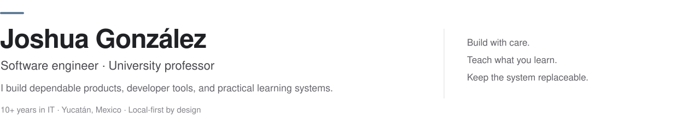

<picture>
  <source media="(prefers-color-scheme: dark)" srcset="./assets/profile-header-dark.svg">
  <source media="(prefers-color-scheme: light)" srcset="./assets/profile-header-light.svg">
  
</picture>

## Selected work

- **[Formulift ↗](https://formulift.app/)** — A browser-based builder for personalized 12-week workout plans and Excel-compatible training spreadsheets. No signup; training data stays on the user's device.
- **AASSE** — Provider-neutral orchestration for reliable AI-assisted software delivery, built around explicit roles, controlled execution, and verifiable evidence.
- **ExotiTrack** — A local-first Flutter application for reptile care and feeder-colony management that remains useful offline.
- **University automation** — Practical systems for assessment, course delivery, attendance, and student feedback.

## How I work

> **Reliable by design · Local-first when it matters · Provider-neutral by architecture · Clear enough to teach**

I prefer explicit contracts, replaceable dependencies, and reproducible workflows. The tools may change; the product should remain understandable and dependable.

## Tools I reach for

Flutter · Dart · React · C# · Python · PostgreSQL · SQLite · Docker · Linux · GitHub Actions

---

  <a href="https://formulift.app/">Formulift</a>
  &nbsp;·&nbsp;
  <a href="https://github.com/JoshuaEGonzalezRuiz?tab=repositories">Repositories</a>
  &nbsp;·&nbsp;
  Yucatán, Mexico 🇲🇽

  Outside software: homelabbing, exotic pets, the family garden, and strength training.

