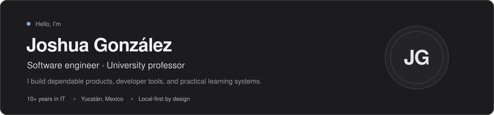
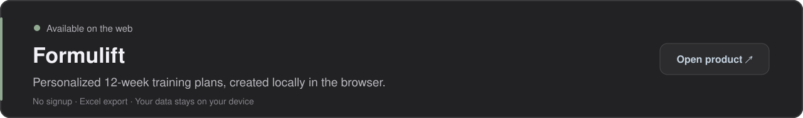
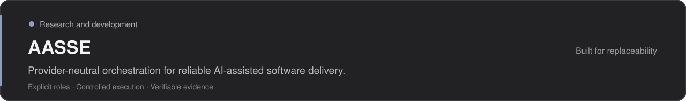
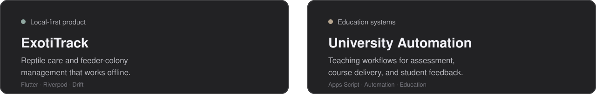

  

## Selected work

## Other things I build

## What guides my work

I care about software that is **reliable by design**, useful without a permanent connection, and built around clear contracts instead of hidden assumptions. Tools and providers should remain replaceable; the product should not.

## Tools I reach for

**Product:** Flutter · Dart · React · C# · Python  
**Data & infrastructure:** PostgreSQL · SQLite · Docker · Linux · GitHub Actions

## Outside work

Homelabbing, exotic pets, the family garden, and strength training keep me curious beyond software.

---

  <a href="https://formulift.app/">Visit Formulift ↗</a>
  &nbsp;&nbsp;·&nbsp;&nbsp;
  <a href="https://github.com/JoshuaEGonzalezRuiz?tab=repositories">Explore my repositories →</a>

